## Early History

1. Alan Turing, 1950
2. Dartmouth Conference, 1956
3. MIT, Minsky, 'spend the summer linking a cam to a computer to describe what it saw', 1966
4. Roerts, Machine Perception of Solids, 1963
5. 3D reconstruction, 1970s/1980s
	1. Extracting edges and inferring the 3D structure
	2. Cylinder or Pictorial
	3. 2.5-D Sketch
	4. Structure from motion
	5. Dense stereo matching
	6. Multi-view
6. Recognitoin? 语义是 classic vision 不能解决的问题
7. Current trend
	1. learning-based method
	2. big data
	3. computation resources

> L2 的自动驾驶还能用 Line fitting 做车道保持？

# Line fitting

## Images as Functions

1. _Image as a function_ $f$ from $\mathrm{R}^2$ to $\mathrm{R}^M$, $f(x, y)$ gives **intensity**.
   Image contains **discrete** pixels
   具体而言, 色彩空间 grayscale: $[0, 255]$, or rgb: Vector3; 
   分辨率 resolution: $w \times h$ => matrix
   像素空间 $w \times h \times 3$ => tensor, 左上角为(0, 0, Color)
2. 立即可求 _gradient_ $\displaystyle \nabla f = \left[ \frac{\partial f}{\partial x}, \frac{\partial f}{\partial y}\right]$, in practice, use $\displaystyle \frac{\partial f}{\partial x} |_{x = x_0} = \frac{f(x_0+1, y_0) - f(x_0-1, y_0)}{2}$, 指定 gradient magnitude $\displaystyle||\nabla f|| = \sqrt{(\frac{\partial f}{\partial x})^2 + (\frac{\partial f}{\partial y})^2}$, point to 与edge垂直的方向
3. _filters_(滤波): form a new image from original pixels, extract useful information. Modify properties
	1. 1D Filter: 线性, 噪声抑制 $h = G(f), h[n] = G(f)[n]$, 一个例子是$\displaystyle h[n] = \frac{\sum_{i=-2}^{i=2} f(x+i)}{5}$,
	2. abstruct: 卷积(convolution, 信号与系统) $\displaystyle h[n] = (f*g)[n] = \sum_{m = -\infty}^{+\infty} f[m]g[n-m]$, 一个解释是$g$翻转再与$f$移动窗口地对位求积
   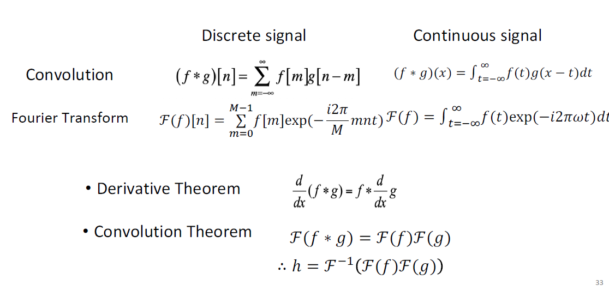
	3. 最重要的卷积定理: For Fourier Transform $F$, $F(f*g) = F(f)F(g)$, 时域的卷积等于频谱的乘积.
	4. 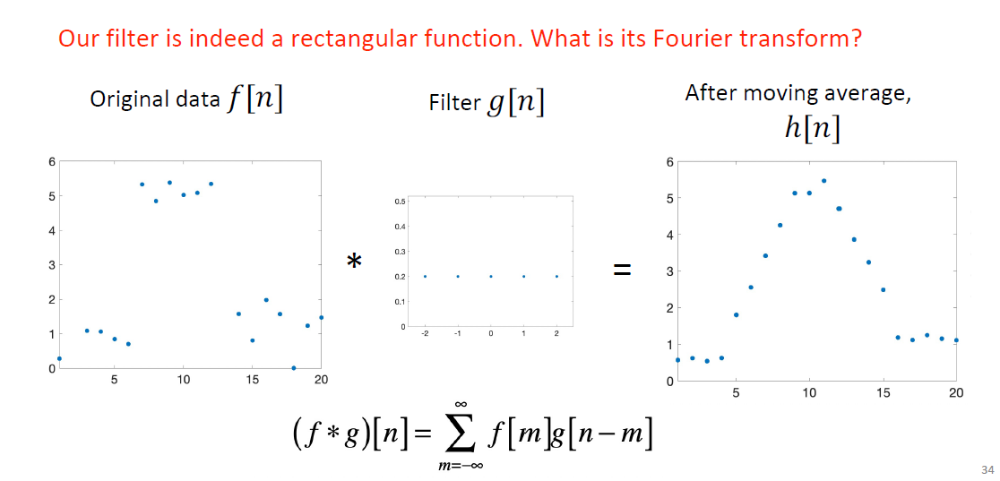
	   Fourier Transform gives $F(g)[m]$ that mainly concentrates around 0, it's its main feature
	   $g$ act as a 低通滤波器 low-pass filter
	   从 Convolution Theorem 解释就能发现卷积提取特征的原因: 滤去高频, 留下低频, 滤去噪声 =>
	   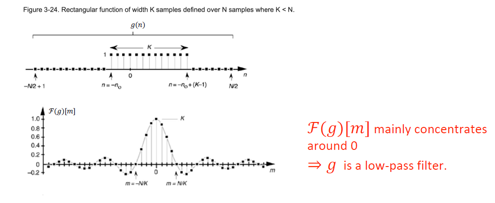
	   filtering $G$ is linear.
	5. if says $loss$ is 结果频率的纯性, 我们通过学习找到最好的$g$的weight
4. _2D discrete filter_: $\displaystyle (f*g)[m, n] = \sum_{k, l} f[k, l]g[m-k, n-l]$, says g as **kernal** or **filter**
	1. 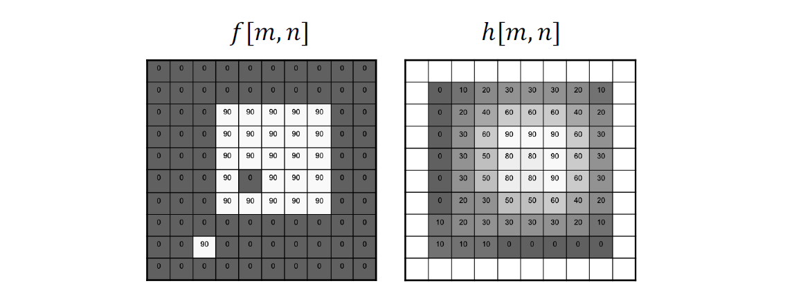
	   使用平均的kernal去除了90的高频信号但模糊了不是特别应该模糊的边界, 边界一定是高频的
	2. 再进行一次二值化, define a threshold 阈值$\tau$, $\displaystyle h[m, n] = \left\{ \begin{aligned} & 1, f[n, m] > \tau \\ & 0, \text{otherwise} \end{aligned} \right.$, non-linear system

## Edge Detection

1. _Define edge_: formulation (研究范式: Definition first, MathOP而不是DOP)
   a region that has significant intensity change along one direction **but** low change in its orthogonal direction
2. _Evaluate_ (评价标准 **Evaluation matrix**)
   思考一下不好的情况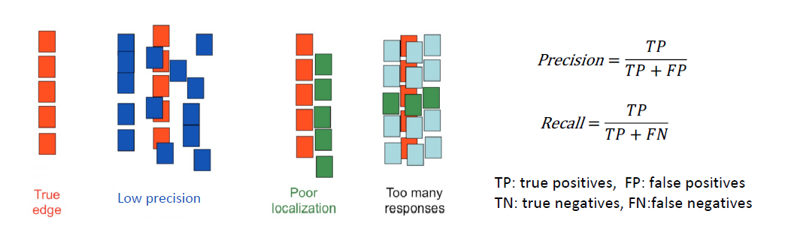
   Example: `Low precision`'s $\displaystyle Precision = \frac{1}{3}$, $Recall = 1$.
   思考如何评定对齐: $\displaystyle localization = \max_{distanceT\to P} < \varepsilon$.
   目标: good $precision$, good $recall$, low $localization$;
3. _Smooth_: 
	1. Problem. Use derivative. 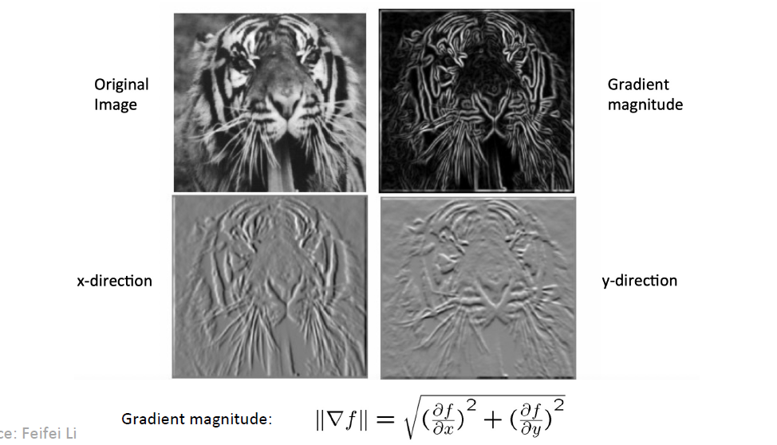
	   **But** 处处不平滑的 noises 可以很好的 hacking gradients => smoothing first.
	   - Gaussian Filter as $g$ to smooth noises: $\displaystyle g = \frac{1}{\sqrt{2\pi \sigma^2}} \exp{- \frac{x^2}{2\sigma^2}}$, the better is $\displaystyle F(g) = \exp{-\frac{\sigma^2 \omega^2}{2}}$.
	   - The bigger $\sigma$ is, the sharper $F(g)$ is. 那么它就是更强的low-pass filter.
	   - The smaller, the filter weaker.
   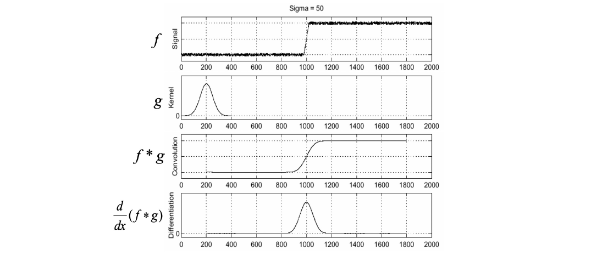
	2. _Optimize_: theorem $\displaystyle \frac{d}{dx} (f*g) = f* \frac{d}{dx} g$, 将两步合为一步
	3. _2D Convolution_: Gaussian Filter $\displaystyle g = \frac{1}{2\pi \sigma^2} \exp{-\frac{x^2+y^2}{2 \sigma^2}}$. Use _Optimize_ again.
	4. _Binaryzation_
   结果: 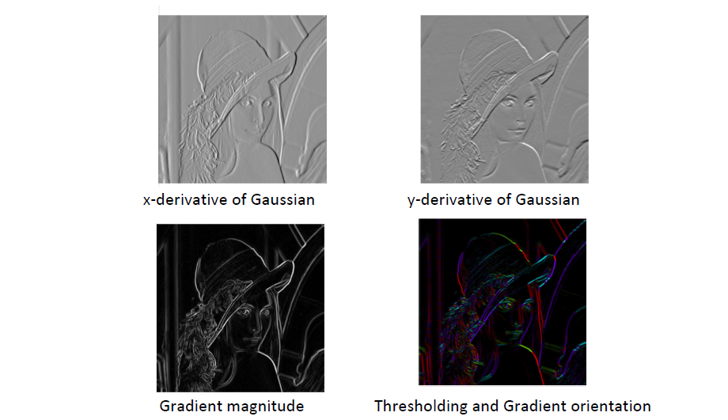
4. _NMS_: 问题是存在宽度大于1的成分, 我们要去除 Non-Maximal 的成分, 只留下最好的
	1. Strategy
		1. Get choice  $q$ and its gradient $g(q)$
		2. Find neighbors (Another two choices): $r = q + g(q), p = q - g(q)$.
		   
		   > Problem: $r$ and $p$ (大多时候)都是非格点, 没有函数值, 怎么办? 进行双线性插值 _bilinear interpolation_.
		   
		   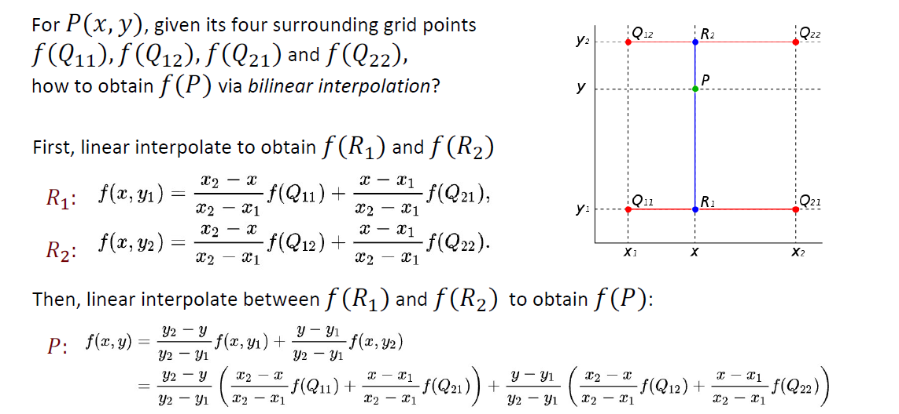
		   很好的是插值结果与投影方向无关. 对线性插值进行了性质很优的延拓.
		   
		   > Another approach: 直接对齐到格点上, 性能很优.
		   
		3. Get $g(p)$ and $g(r)$.
		4. $g(p) < g(q) > g(r)$ proves $q$ is a maxium.
	2. 结果 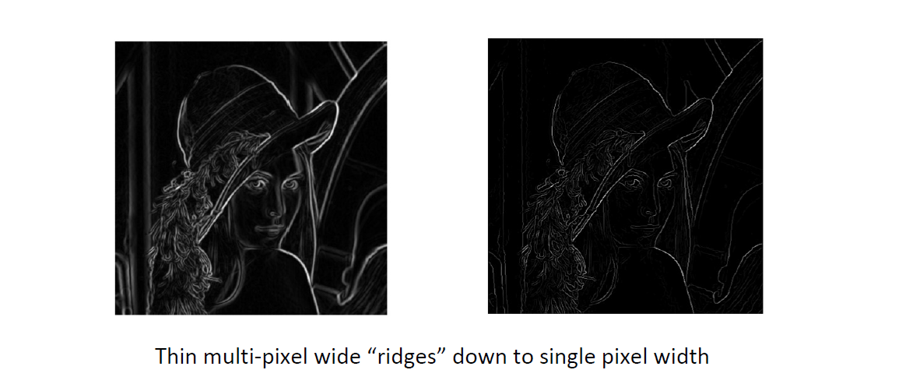
5. _Edge linking_: Hysteresis Thresholding 滞回阈值(乱搞)
	1. gradient > maxVal => begin
	2. gradient < minVal => remove
	3. gradient between min and max => connect but no begin

### Canny Edge Detector

Use:
- first derivative
- Gaussian kernal
- optimize signal-to-noise ratio to maxium $precision$ & $recall$

超参$\sigma$:
- bigger $\sigma$, bigger $precision$
- smaller $\sigma$, smaller $recall$

## Least Square Method

### Review

1. 目标：Lane Detection
2. 完成的部分：Edge Detection
3. 现在的目标：从散点到直线，得到更好的 Line Fitting

### SVD

4. _Least Square Method_：L2 norm - Find $(m, b)$ to minimize $\displaystyle E = \sum_{i=1}^n (y_i - mx_i -b)^2$
	1. let $\displaystyle Y = \left[\begin{matrix}y_{1} \\ \vdots \\ y_{n} \end{matrix}\right]$ , $\displaystyle X = \left[\begin{matrix}x_{1} & 1 \\ \vdots & \vdots \\ x_{n} & 1 \end{matrix}\right]$, $B = \left[\begin{matrix}m\\b\end{matrix}\right]$, $\displaystyle E = ||Y-XB||^2$, finally gives $\displaystyle B = (X^TX)^{-1}X^TY$，必要数学参见 matrix cookbook
	   
	2. 一个凸优化问题，且具有唯一全局最小值
	3. Limitation: For **outlier**, it's not robust, 离群点会把线全部带偏; fails for vertical line
	4. Improvement: Use $\displaystyle ax+by=d$, to maxmize E, data $\displaystyle A = \begin{bmatrix}x_{1} & y_{1} & 1 \\ \vdots & \vdots & \vdots \\ x_{n} & y_{n} & 1\end{bmatrix}$, $\displaystyle \boldsymbol{h} = \begin{bmatrix}a \\ b \\ d\end{bmatrix}$. 此时得到的最小二乘回归方程 $\displaystyle \boldsymbol{Ah} = 0$，并满足 $\displaystyle E=||\boldsymbol{Ah}||^2$ 最小；它有一个平凡解 (0, 0, 0)；指定 $\displaystyle a^{2}+b^{2}+d^{2}=1$ 可以让解唯一化，失去平凡解
5. _Solve_：Find $\displaystyle \boldsymbol{h}$, minimize $\displaystyle ||\boldsymbol{Ah}||$, subject to $\displaystyle ||\boldsymbol{h}||=1$
	1. 问题转化：找到单位球面上的一个点使得这个点和A的点积最小
	2. 方阵矩阵的特征值分解：实对称方阵一定可以对角化 => 解 $\displaystyle Bx=\lambda x$ 得到 n 个特征值 $\displaystyle \lambda$ 和 $\displaystyle x_{i}$ => 凡是可以对角化的矩阵 n 个特征向量构成正交基 => 取最小的 $\displaystyle \lambda$ 时 $\displaystyle ||\boldsymbol{Bh}||$ 最小 (把对应的维度压缩到最小)
	3. 非方阵矩阵不能做特征值分解/对角化 => 提出了一种从方阵到非方阵的extension：Singular Value Decomposition (SVD)
6. _Analysis_：**Robustness** Absolutely still sensitive to outliers; 这来自 L2 Norm 越离群 gradient 就越大的特性; 如果用 L1 Norm？收敛就很困难

## RANSAC

> Random Sample Consensus: 解决离群点的问题

1. 自动丢掉离群点的方法：如果已经知道了答案，离群点就会离它significantly地远；那么就随机取出一个Sample，求这个Sample构成的hyperplane(如果Sample数大于维度就要最小二乘或SVD了，等于维度就可以直接求解线性方程组)，再衡量Consensus，让支持它的dataset里尽可能没有outlier
2. _RANSAC Loop_
	1. Initialize: 随机取 **2** 个点 (期望不包含Outlier，所以是最少的可以形成hyperplane的seed group)
	2. Compute: transformation from seed group
	3. Inliers: 计数合群点的数目，更新最大Inliers => 找到Inliners最多的那个Sample

> We should implement a parallel version: **Use Tensor, No For Loop**

3. _Hyperparameters_
	1. Hypothesis: 取出多少个点做Sample
	2. Theoshold: 算作Inlier的阈值 (例如 $\displaystyle 3\sigma$)
4. _Post-process_：如果多个seed group给出了相同的Inlier number？朴素的优化 => 把这些Inlier选出来，用最小二乘或SVD给出最后的结果的那个方程
5. 为什么要选最小数目的hypothesis？包含n个点的hypothesis全都正确的概率是 $\displaystyle \omega^{n}$，所有的k个sample全部fail的概率是 $\displaystyle (1-\omega^{n})^{k}$，所以需要尽量减小n，增大k
6. _Pros and Cons_
	1. Pros: general, easy
	2. Cons: only moderate percentage of outliers => Voting Strategy, Hough Transform

## Summary

gradient -> edge -> line

> 这个是 module-based system，缺点是一步出错就会影响很多，需要很强的robustness；自动驾驶从几十万行的rule到End2End的system也是这样的；
> Lecturer: 某司唯一的不端到端的是提取出红绿灯🚥结果识别，再丢进网络里；
> 这部分总之只是对经典视觉方法的管中窥豹；

# Corner Detection

## Harris Detection

1. 图片的 keypoints 也是很重要的东西，应用例：从关键点检测keypoints localization，到corri-bonding到image matching到相机的rotation/transform的识别
2. _Requirements_
	1. Saliency: Interesting points
	2. Repeatability: same result, same object, different images
		1. 对亮度的不变性 Illumination invariance
		2. Image scale invariance
		3. Viewpoint invariance
			1. implant rotation: 关于相机主轴的旋转
			2. affine: 产生仿射变换 (?)
	3. Accurate localization
	4. Quantity: number sufficient
3. _Corner_
	1. 基本满足上面的requirements
	2. key property: in the region around the corner, image gradient has two or more dominant directions
	3. Harris Corner: Use a Sliding Window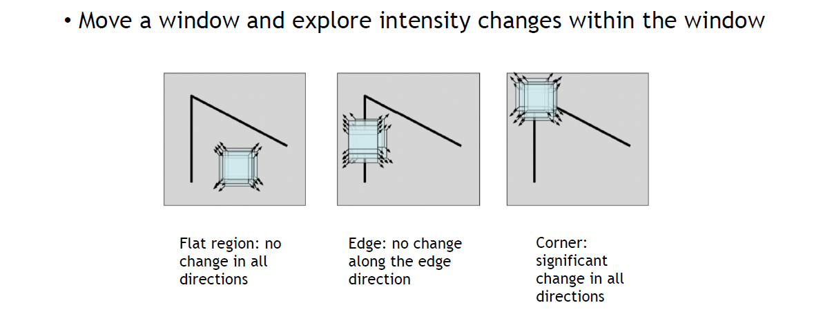
	   留意我们没有再进行edge detection，这里衡量gradient的方法是滑动窗口内的intensity
4. _Implement_
	4. Move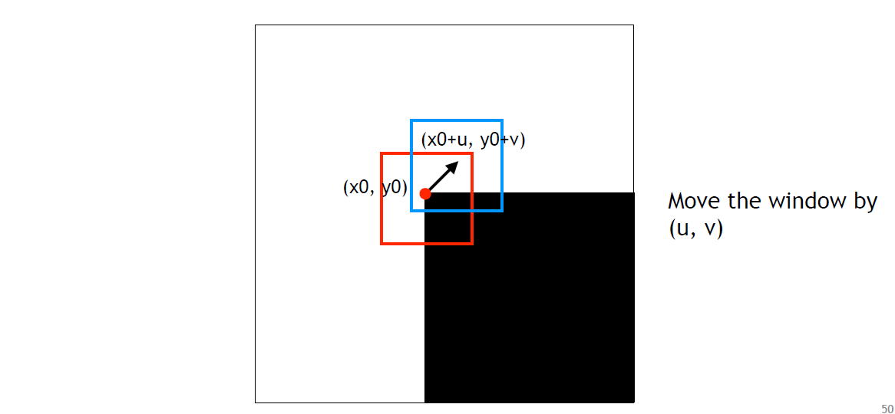
	5. Square diff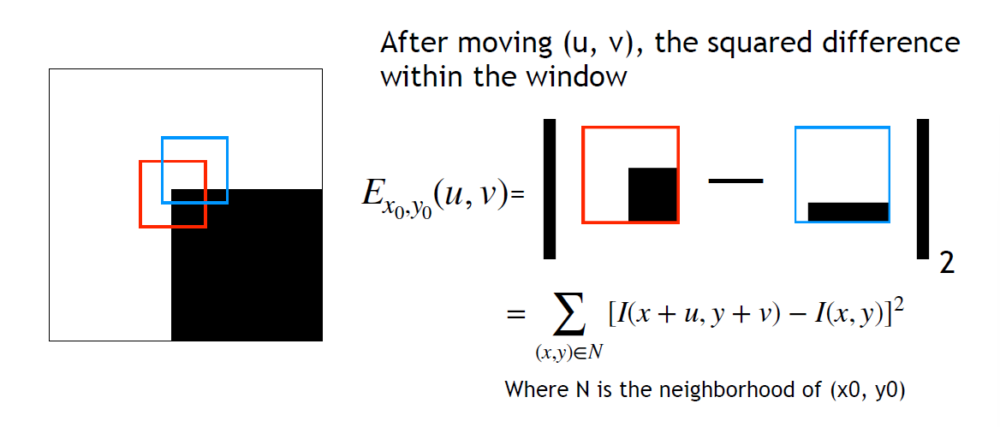
	6. Window function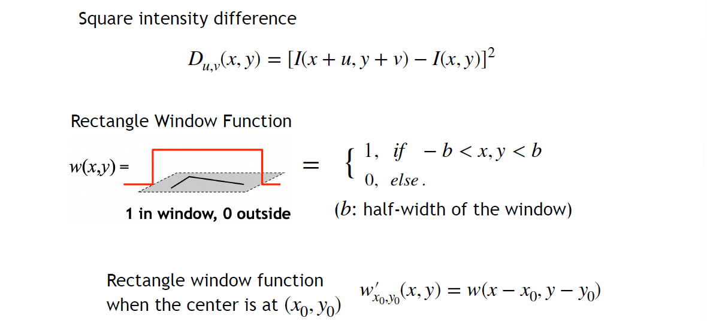
	7. Let Square intensity difference $\displaystyle D(x, y)=[I(x+u, y+v)-I(x, y)]^{2}$
	   Window Function $\displaystyle w(x,y)$ which has a param $\displaystyle b$
	   => 成为一个卷积操作$$\begin{align}\displaystyle E_{x_{0},y_{0}}(u,v) & =\sum_{x,y}w^{\prime}_{x_{0},y_{0}}(x,y)[I(x+u, y+v)-I(x, y)]^{2} \\ & =\sum_{x,y}w(x_{0}-x,y_{0}-y)D_{u,v}(x,y) \\ & =w*D_{u,v}\end{align}$$
		1. 在 $\displaystyle (x_{0},y_{0})$ 周围关于 $\displaystyle (u,v)$ 做一阶 Taylor 展开，进而把 $\displaystyle D$ 写成二次型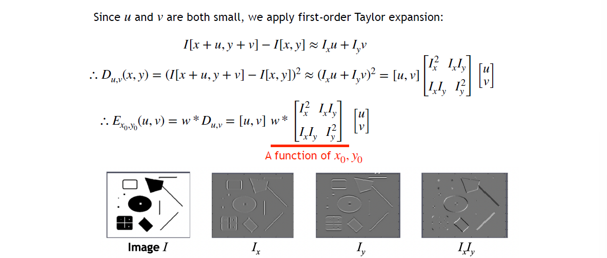
		   注意每个I都是一个大的image
		2. Result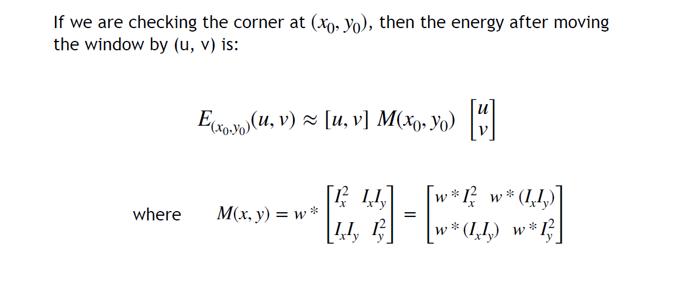
		3. Analysis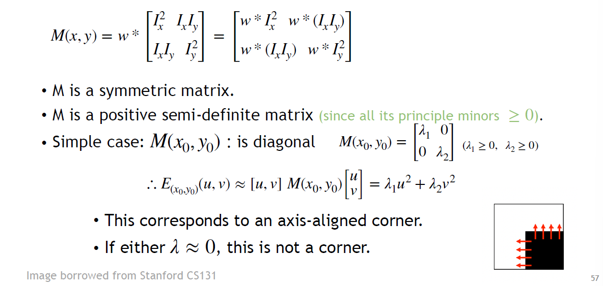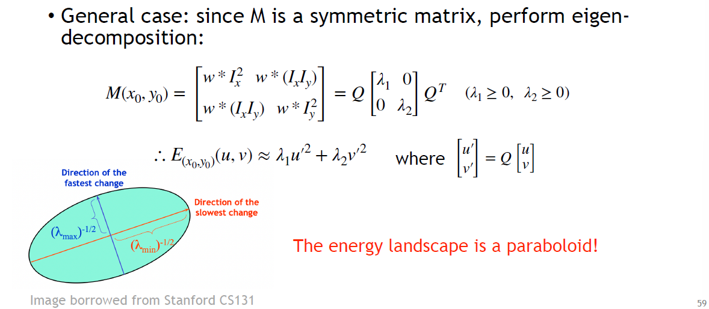
		4. Corner/Edge/Flat? 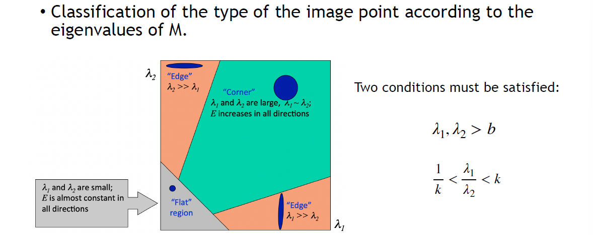
		5. 问题：多大算大？可能需要多个超参，但我们只关心corner，可以定义
		6. let window rotation-invariant => Gaussian window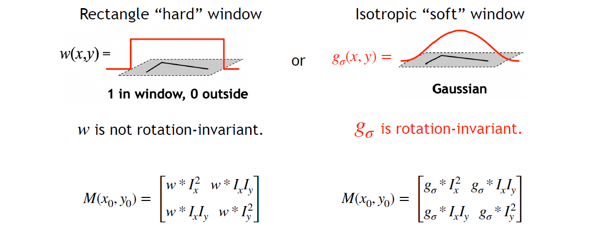
5. _Whole Process_ 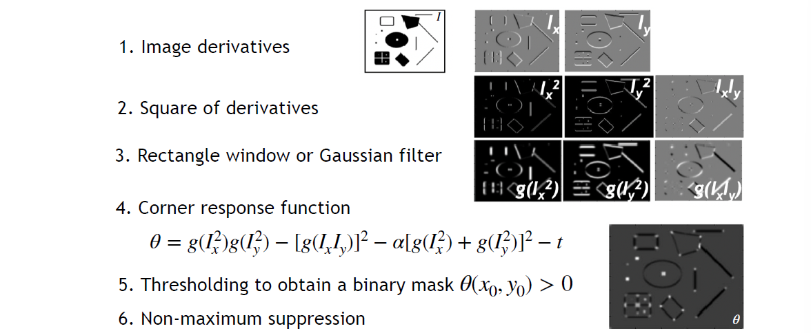

> 这一部分推导较多，遂直接放了课堂slides

## Properties

> **Definitions**
> If $\displaystyle X\in V$, and $\displaystyle f:V\to V$ is a function, $\displaystyle T:V\to V$ is a transformation operation like translation or rotation, then
> - $\displaystyle f$ to be **equivariant** under $\displaystyle T$ if $\displaystyle T(f(x))=f(T(x))$
> - $\displaystyle f$ to be **invariant** under $\displaystyle T$ if $\displaystyle f(x) = f(T(x))$

1. _Scale_
	1. Harris Detection 对 translation 和 rotation (?) 都是 equivariant 都是等变的
	2. To be realistic, 旋转后对网格进行了双线性差值，自然都不可能是rotation-variant的
	3. 对 scale 不是 invariant 的 (自然也没有equivariance)，但问题不大
2. Scale-invariant methods: _Harris Laplacian_ 和 _LIFT_