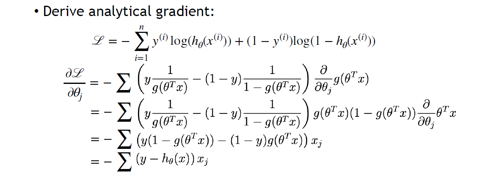

# Machine Learning 101

## Feature Description

1. 我们现在在做什么：non-learning based method $\displaystyle \to$ learning based method
2. 传统方法设计的 Feature Descriptor 面对广泛的世界环境变得不可用，把对局部的描述交给 Learning
3. Feature: any piece of information which is relevant for solving the computational task related to a certain application
	1. drop non-useful features
4. Model
	2. _Heuristic model_: 拍脑袋
	3. _Parametric model_: 参数完全由数据拟合
5. non-learning 到 learning 是 _光滑的_ 过渡

## Outline

> 经典的例子：数字分类 MNIST

1. _Task_ 
	1. Output 为什么是 Probability: 更多的优化手段
2. _Prepare the data_
	2. From MNIST: 70000 imgs, 28 $\displaystyle \times$ 28, 今天的问题简化到「是否是5」
3. _Built the model_
	1. 粗暴的 Logistic Regression: flatten to 1-D vector $\displaystyle \mathbb{R}^{784}$
	2. let $\displaystyle \theta \in \mathbb{R}^{784}$, function $\displaystyle g = \theta^{T}\boldsymbol{x}$
	3. then, use sigmoid $\displaystyle \frac{1}{1+e^{ -z }}$ 把 $\displaystyle g$ 的结果映射到 $\displaystyle [0, 1]$
	4. 问题: 函数 $\displaystyle g$ 中包含能完美分类的函数吗？先假设存在？
4. _Decide the fitting_
	1. let loss = square? 这是没有根据的
	2. 沿着概率论的方向前进
		1. 最大似然估计 maximum likelihood estimation MLE: 
		   $\displaystyle \boldsymbol{P} = \prod P(x_{i}, y_{i}) = \prod\left\{\begin{align} & p,&y_{i} = 1 \\  & 1-p, & y_{i}=-1\end{align}\right.$
		2. Maximum $\displaystyle \boldsymbol{P}$ (命中可能性的乘积 => 全部命中的概率)
		3. 求 likelihood 的最大值
	3. 藏起来分类讨论 
	4. 乘积 => 数学取巧之求对数 
	5. 有趣的历史遗留：永远做 Minimize
	   NLL Negetive Likelihood Loss: Loss = $\displaystyle \mathcal{L}(\theta) = -\log p(Y|X;\theta)$, Minimize Loss
5. _Optimization 101_
	1. Loss 是没有解析解的
	2. 或许 Loss 是凸的？
	   如果 NLL 是凸的，那么可以简易地解析地给出最低点，可惜 NLL 是坑坑洼洼的
	3. gradient descent (GD)：一阶的optimization方法，显然只会收敛到局部最小
		1. Update rule: $\displaystyle \theta := \theta - \alpha \nabla_{\theta}\mathcal{L}(\theta)$
		2. 超参 $\displaystyle \alpha$: 太小就太慢，太大就 overshoot
		3. 接受这个现实！
	4. GD Implement
		4. For Sigmoid, $\displaystyle g^{\prime}(z)=g(z)(1-g(z))$
		5. 对 Loss 求导
		6. 超参 weight initialization，会很大地影响收敛到的 local minima
	5. 补救方法(最简单的)
		1. Batch Gradient Descent：对一个 batch(16/64/128) 求 gradient，这将使得gradient在全局gradient基础上增加一个噪声，使得descent可以跳出较浅的local minima；
		2. Stochastic Gradient Descent：选择mini-batch的方法，从所有数据中随机选择 N pairs as a batch and compute the average gradient from them
			1. **+**: fast
			2. **+**: can get out of local minima
6. _Testing_
	6. 分割Dataset `|------------Training Dataset------------|--Testing Dataset--|`
	7. 「高考应该考新题，不考见过的题」
	8. 用 NLL 评判 Testing Dataset 吗？模型最后 Evaluate 的应该是 classification accuracy，NLL 不直观甚至可能与 accuracy 冲突
	9. 泛化能力 Generalization gap

 > 为什么不用 accuracy 做 loss？Non-Differentiability 的准确率是离散的不可微的无法反向传播的，轻微调整参数无法跳出local minima的，对置信度不敏感的

## 结语

简单分类方法 Logistic Regression 的局限性：
选择的点积函数 $\displaystyle \theta^Tx$ 是一个 hyperplane，只能处理线性可分问题. 

本节我们学习了

- Machine Learning 的范式：_Prepare data_ -> _Build model_ -> _Optimization_ -> _Test_
- 在 _Build model_ 中只涉及了单层线性函数，结果只能处理线性问题，令人失望：下次将要开始拓展神经网络 _Model_

# MLP & CNN Introduction

> 接上节：FC 的 capasity/expressivity 太小了！

## Multi-Layer Perceptron (MLP)

1. 线性层堆叠没有意义：$\displaystyle \mathbb{R}^{c_{1}} \to \mathbb{R}^{c_{2}} \to \mathbb{R}^{c_{3}}$ 仍然是线性的，堆 non-linear 的东西才有用
   有意义的 $\displaystyle g$
	1. 要做的事：Input -> flatten -> Hidden Layer -> Output
	2. fully-connected 全连接层，下一层的所有neuron都连接到上一层的所有neuron
	3. Hidden Layer 的选择：选 Input 和 Output 之间的一个值，或许从信息凝聚的角度解释
2. 范式
	1. _Initialization_: randomly generate $\displaystyle \boldsymbol{W}_{1}\in \mathbb{R}^{784\times 128}$ and $\displaystyle \boldsymbol{W}_{2}\in \mathbb{R}^{128\times 10}$
	2. _Forwarding_(前向传播)
	3. ***Gradient Descent***: Update weights
3. _Backpropagation_
	4. 我们已经不太好给出多层情况下 Gradient 的解析形式
	5. Chain Rule
		1. Upstream gradient 一步步与中间的 Local Gradient 相乘最后回到第一层
		2. 这样实现了自动微分机制 Auto Differentiation，Computational Graph -> Diff.
4. _Activation Function_
	1. 之前用到 Sigmoid 是把 $\displaystyle \mathbb{R}$ 映到 $\displaystyle [0, 1]$
	2. 这里的激活函数是用来实现 non-linear 的 neuron，因为有non-linear，所以有一切函数 
	3. 选$\displaystyle \tanh$？不会丢掉一半区间；选$\displaystyle \text{ReLU}$？事实上只要不是全线性，就不会退化为一个线性层，这样可以简化计算；
	4. Optimization上，ReLU负位置的前面的neuron在BP时干脆可以直接丢掉了，不被Update；引入Leaky ReLU使得BP时所有neuron都被update
	5. 为什么大家还是愿意使用ReLU？在正位置性质足够好；可以从生理上理解；Rectified Linear Unit
	6. tricky要用到更加好的optimization，比如leaky relu；但是对于分类这样的问题，relu就足够好

## MLP Summary

- MLP 采用的 _Model_：Input -> function: Hidden Layer(non-linear) -> Output
- 如何让 function 足够 _non-linear_：非线性的激活函数的叠加
- MLP 结构 & _Chain Rule_：Initialization -> Forwarding -> Backpropagation

## Convolutional Neural Network

1. MLP Problems
	1. **Deep Learning I** 中学习了 FC 全连接网络
	2. MLP 由多层的 FC 构成，也有人管 MLP 叫 FC
	3. MLP 用最丰富的神经连接相连接的神经层，很贵，适于处理密集的数据；flatten也很不讲道理，破坏了图片的结构；矩阵$\displaystyle \boldsymbol{W}$也非常巨大，参数量很恐怖
2. _CNN_
	4. 卷积操作
		1. 卷积核kernal/filter参数通过学习得到(一个convolution kernal应该是C个filter)
		2. 不严格遵循卷积规则：直接对位相乘；但其实仍严格符合数学的卷积定义
		3. 考虑 image($\displaystyle 32\times 32 \times 3$) 和 filter($\displaystyle 5 \times 5 \times 3$) 之间的点积，最后得到$\displaystyle 32 \times 32 \times 1$(channel=1)的结果
		4. 这时候filter是否各向同性都无所谓了，与要抽取的特征有关
		5. filter可以再加bias => $\displaystyle w^{T}x+b$
			1. share1个bias 还是 $\displaystyle 32\times 32 \times 3$个bias还是 $\displaystyle 5\times 5 \times 3$个bias？
			2. 结果是共享同一个bias
			3. 其他的选择：不符合Conv的规则，破坏卷积的平移等变性
		6. 角落上的Conv：最原始的大小缩减作用
	5. 可以由多个filter各对image卷积一次，得到一组activation maps/feature maps
	   >信息从局部语义向更高维的空间移动
	   
	6. 完成Conv后一定要做ReLU：两次线性操作之间
	7. 最后还是用一个Linearly separable classifier(FC)得到结果
		1. ReLU的意义：feature extract，杀掉neuron
		2. bias的意义：决定杀掉哪些neuron
3. 步长 _Stride_：增强大小缩减作用 => 不匹配时就会损失信息
	1. Output size: **(N - F) / stride + 1** => 不匹配就得到非整数
	2. 补救手段：padding
		1. zero
		2. Output size' = **(N + 2P - F) / stride + 1**, 其中 **P = (F - 1) / 2** 会实现输入输出dimension不变 (这很好 :P)
	3. parameters number: `filter_num * (x * y * channels + 1)`
		1. CNN 大大减少了 parameters 数量！
	4. Common Setting：取channel数为powers of 2，filter size是奇数(容易padding)
4. 池化 _Pooling_
	1. 池化真是莫名其妙的翻译，这是另一种大小缩减方法
	2. e.g. _MAX Pooling_ 在每一个 2 $\displaystyle \times$ 2 filter 里取最大的那个(信息损失还好，因为只要不是第一层Conv，这个 _MAX_ 就是先前周围几块通过filter综合得到的)
	   _Average Pooling_ 等价于一个 $\displaystyle \begin{matrix}1 & 1 \\ 1 & 1\end{matrix}$ 的 $\displaystyle 2 \times 2$ filter, stride = 2
	3. 处理奇数情况：$\displaystyle W^{\prime}=\left\lceil  \frac{W}{2}  \right\rceil$
	4. 应用例：Style -> _Average Pooling_ Classification -> _MAX Pooling_

## Comparison: MLP & CNN

1. FC and ConvLayer
	1. FC: fully/densely connect
	2. ConvLayer: 一个输出cell只和周围filter size内的输入有关，parameters远少于FC => 计算开销
		1. 近场效应 Sparse Connectivity => 信息蔓延的过程 (受到了来自 transformer 的挑战)
		2. Parameter Sharing => 这是Conv与生俱来的
2. FC and CNN: which is more expressive?
	1. FC is super set of CNN: FC 显然可以表达所有的 Conv(只需要non-sparse的神经weight为0)
	2. FC is worse than CNN: MLP 在训练集上的 accuracy 都会不高，更不用说过拟合：在巨大的空间中有过于多的local minima，param太多了
3. 识别猫猫：背景/角度/光照变化太多，网络应该对这些因素具有robust => CNN天然
   例子：
   对FC来说Input翻天覆地了！
4. CNN对transform是Equivariance的：$$S_{A}[\phi(X)]=\phi(T_{A}(X))$$
   rotation如果是isometric的那么是equivariance的，但大概率filter不是isometric的，那么rotation可能就没有equivariance，但小的rotation下 _Pooling_ 会对rotation有一定的robust
5. 这 **终于！** 特别好地回答了为什么要 parameter sharing
6. 结论：CNN with ConvNet 和 pooling layer 对 translation 很好地 invariance，rotation有一点点invariance；CNN在各处有相似质量的local minima

# CNN Training

> 本节聚焦 Training 的细节和努力减小 Training 和 Test 之间的 Gap

## CNN Training Details

1. Mini-batch SGD：For loop
	1. _Sample_：Shuffle => Split成batch
	   (Dataloader) 为什么要Shuffle：为了Random，Dataset可能是按数据类别分类排序的，这样一个batch的gradient会和整个Dataset有很大的偏差
	2. _Forward_
	3. _BP_
	4. _Update_
2. 框架：TensorFlow❎ => PyTorch & CUDA✅

### Data preprocessing

> 任何操作的目的是 training friendly，但总是 information loss 的

1. zero-centered `X -= np.mean(X, axis = 0)` ：为了平等地兼顾各个维
   **对于图片而言应该是整个dataset求一个所有pixel的mean，也就是说mean是一个`(R * G * B)`值**
2. normalize `X /= np.std(X, axis = 0)`：因为不论是ReLU还是sigmoid都对大于0/小于0最为轻松而敏感；(e.g. VGGNet 不除std，ResNet 除了std)
   **假想一种红色std很大而蓝色很小的情况，如果对蓝色-mean再/std，这使图片并不显著的蓝色特征(甚至是噪声)被放的特别大(和红色一样了)，这显然不利，当然这不是常见的情况；例如对一副蓝色扑克牌的数据集我们就最好不要/std**

### Weight Initialization

1. _Small random numbers_: `W = 0.01 * np.random.randn(Din, Dout)`
   ~okay for small networks, problem with deeper
	1. 以一个6-layer net为例，每次乘这个Small random W，zero-centered并normalize后的数据分布就向0集中一点
	2. 意味着gradient dL/dW在layer方向上不断缩小，它们却应用相同的learning rate，所以deeper layer几乎到了all zero的程度，故而no learning
	3. 如果简单地调大也没有用随着deeper，它的gradients也是0. no learning =(
2. _Xavier Initialization_：`W = np.random.randn(Din, Dout) / np.sqrt(Din)`
	1. 可以保证 Var(y) = Var(x_i) only when Var(w_i) = 1/Din
	2. 效果：相当于找到了0.01-0.05之间的一个最好的值，使得分布总不会发生变化；起作用的关键**并非**让每层之间的缩放因子发生变化；这里分布仍然发生了变化是来自tanh的缩放作用
	3. 解释：$\displaystyle \boldsymbol{Y}_{\text{Dout}}=\boldsymbol{W}_{\text{Din, Dout}}\boldsymbol{X}_{\text{Din}}$，希望如果X~(0, Var)，那么Y~(0, Var)，因为方差Var(y)=Var($\displaystyle \sum x_{i}w_{i}$)=Din Var($\displaystyle \boldsymbol{X}$)Var($\displaystyle \boldsymbol{W}$)，所以应有 Var(w) = 1/Din
	4. 对Conv而言？每次运算是把 3 $\displaystyle \times$ 3 个 Cin 变成 Cout，所以 Din = filter_size^2 * input_channels
	5. Problem: tanh已经过时
3. _He Initialization_：`W = np.random.randn(Din, Dout) / np.sqrt(2/Din)`
   Change from tanh to ReLU
	1. Xavier 不好用了
	2. 进行修正：每次乘2

> Initialization is still an Active Research Area

### Optimizer

1. SGD Problems
	1. high **condition number**: ratio of largest to smallest singular value of the Hessian matrix is large, 疯狂振荡
	2. 鞍点 **saddle point**: 它甚至都不是 local minima，但是 gradient 就是0可能表征为loss停留在一个较大的位置不动了
	3. **noisy** SGD: 跳出不好的 local minima 和停留在好的 local minima 的冲突
2. _SGD + Momentum_
3. _Adam_ 

### Learning Rate

1. Undershoot & Overshoot
2. _Appropriate_ learning rate: 1e-6 ~ 1e-3
3. _Schedule_ for learning rate: **Step** reduce OR **Function** control

> Iteration: $\displaystyle W_{t}$ --- Update Rule --- > $\displaystyle W_{t+1}$, represents a gradient descent step
> Epoch: 对整个training data进行了一整个complete pass是一个epoch
> - 可用一个epoch的average loss画loss curve；
> - 可以每一整个epoch之后进行一次validation，画plot train curve
> 	- Validation Loss
> 		- _e.g._ NLL Loss on Validation Dataset
> 	- Evaluation Metric
> 		- Accuracy
> 		- Precision/Recall
> 		- F1
> 		- ...
> - 可以每一个epoch后存个档

> 对于特别大的数据集，真的要一个epoch做一个plot train curve的point，evaluate on val，save model吗？不好；根据具体情况更好，很多llm「一次成型」只训一个epoch；让我们重新定义epoch！认定一个epoch就是5000个iteration，这也好. 只是注意
> - 像learning rate schedule这些东西的重新处理；
> - 总是要根据dataset的大小调整：如果数据集大小翻了倍？首先epoch的大小是受显存限制的，dz的3050Ti显然就不能照抄人家H100的batch_size（）注意模型真正的基础是iteration，调schedule最终应该看根据batch_size缩放；
> - 理论上batch size大，gradient质量更好，但噪声也更小，经验公式：learning rate ~ batch size；
> - 2倍的iteration数和2倍的batch size哪个更好？这没有constant的答案

> CNN Training 并不是一件过于黑盒的事情；在各 Optimizer/Parameter 都有很好基础的时代，请不要忘记被调参支配的恐惧. 当你的结果不行，Outline的每一步都可能是造成问题的原因

## Underfitting & Overfitting

1. _Underfitting_
	1. 模型在training set上都不好
	2. 原因：注意dataloader很容易有bug，别搞`X.shuffle`, `Y.shuffle`这种事情
	3. 原因：模型capacity太小 => 加宽/加深，加深比较有效因为non-linear层是capacity的关键
2. _Batch Normalization_：一般插在 FC/Conv Layer 和 non-linear 之间
	1. _Training Mode_
		1. 计算每一个输入 batch 的mean $\displaystyle \mu$和std $\displaystyle \sigma$
		2. 进行normalization完成batch的白化/白噪声化/标准正态分布化
		3. 这大大限制了神经网络的capacity，例如这下ReLU必须砍掉一半了 => 所以存储了参数$\displaystyle \gamma$和$\displaystyle \beta$，这是存储在Layer内的param被所有data所共用 => 允许这个Layer去学一个合适的mean和std去干掉指定比例/位置的data
		4. 结果经过 _BN Layer_ 的一定是一个高斯分布
	2. _Eval Mode (Test)_
		1. 这时明显不能一个个batch地操作了，我们 _BN_ 的mean和std从哪来？
		2. Eval Mode使用的 $\displaystyle \mu$ 和 $\displaystyle \sigma$ 是训练过程中存储下来的average；相对来说反映了这一个layer需要的mean和std
	3. _Pros and Cons_
		1. 原先每个层只有iteration视角weight $\displaystyle W$($\displaystyle \omega$和bias) -> non-linear，现在还加上了mean和std从整体视角控制data的分布，为layer增加了「自由度更低的 => 因而更美好的可控性」(Personal) => 对各种各样的数据归到同一的分布从而具有同一的效果，增强泛化能力
		2. 对更大的LR和更深的layer都有了更好的tolerance，否则high learning rate一下就炸了
		3. Why?
			1. Original Hypothsis: mitigate the "internal covariate shift"
			2. New findings: smoothen the loss landscape (Lecturer: 还行，但不那么清楚)
		4. Cons
			1. Train 和 Eval Mode 下对同一个 Data 能产生不同的 output
			2. batch size越小这种不稳定性越显著 (越大的size的mean和std和总体mean和std越无偏地接近)，Test Performance会有一个很大的drop
	4. _Normalization Techniques_
		1. 按照Channel数，BatchNorm的mean和std都是 $\displaystyle C$ 维的
		2. 保持batch内的data point独立性 => 干脆对一个data point的一个Layer求mean和std 
		3. Batch Norm: 跨越data point做norm，一次一个channel
		   Layer Norm: 一个data point的所有东西做一次norm => 适用于NLP
		   Instance Norm: 一个图的一个channel做一次norm(不太讲道理，一个Channel的所有pixel的分布怪怪的) => 适用于Style
		   Group Norm: 一个图，允许沿着channel算，但不允许只算一个channelN: 一个batch里的n个data point
		   C: 一个image的c个channel
		   H, W: flatten的image pixel
		4. 后三种都没有Training/Eval Gap；Layer和Instance对一般任务效果都不太好；batch size小的时候Group Norm效果好于Batch Norm